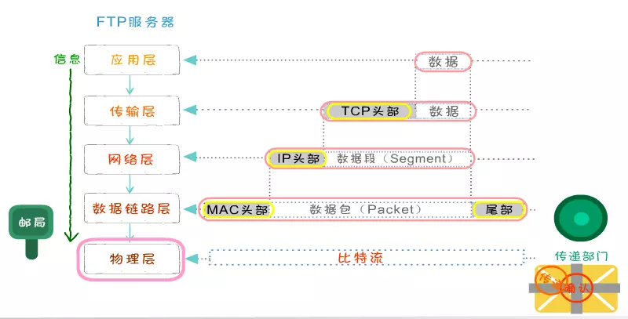

# HTTP

> Hyper Text Transfer Protocol（超文本传输协议）。设计HTTP最初的目的是为了提供一种发布和接收HTML页面的方法。通过HTTP或者HTTPS协议请求的资源由统一资源标识符（Uniform Resource Identifiers，URI）来标识。

## 特点
1.简单快速：客户向服务器请求服务时，只需传送请求方法和路径。请求方法常用的有 `GET、HEAD、PUT、DELETE、POST`。每种方法规定了客户与服务器联系的类型不同。由于HTTP协议简单，使得HTTP服务器的程序规模小，因而通信速度很快。

2.灵活：`HTTP` 允许传输任意类型的数据对象。

3.无连接：无连接的含义是限制每次连接只处理一个请求。服务器处理完客户的请求，并收到客户的应答后，即断开连接。采用这种方式可以节省传输时间。

4.无状态：**HTTP协议是无状态的，HTTP 协议自身不对请求和响应之间的通信状态进行保存。任何两次请求之间都没有依赖关系。** 直观地说，就是每个请求都是独立的，与前面的请求和后面的请求都是没有直接联系的。协议本身并不保留之前一切的请求或 响应报文的信息。这是为了更快地处理大量事务，确保协议的可伸缩性，而特意把 HTTP 协议设计成如此简单的。

## HTTP报文

Http报文包括请求报文和响应报文两大部分，其中请求报文由**请求行（request line）**、**请求头（header）**、**空行**和**请求体**四个部分组成。而响应报文由**状态行**、**响应头部**、**空行**和**响应体**四个部分组成。接下来我们详细介绍下请求报文的各个部分及其作用。

## HTTP请求方法

- GET 1.0/1.1
读取数据，而不应当被用于产生“副作用”的操作中

- POST 1.0/1.1
提交数据，请求服务器进行处理（例如提交表单或者上传文件）。

- PUT 1.0/1.1
向指定资源位置上传其最新内容。

- HEAD 1.0/1.1
**获得报文首部。** 不必传输全部内容的情况下，就可以获取其中“关于该资源的信息”（元信息或称元数据）。

- DELETE 1.0/1.1
**删除文件。** 与PUT相反的方法。DELETE是要求返回URL指定的资源。

- OPTIONS 1.1
**询问支持的方法。** 有些服务器可能会禁止掉一些方法例如DELETE、PUT等。

- TRACE 1.1
回显服务器收到的请求，主要用于测试或诊断

- CONNECT 1.1

**要求用隧道协议连接代理.**
HTTP/1.1协议中预留给能够将连接改为管道方式的代理服务器。通常用于SSL加密服务器的链接（经由非加密的HTTP代理服务器）。

## HTTP状态码
仅记录在 RFC2616 上的 HTTP 状态码就达 40 种，若再加上 WebDAV（RFC4918、5842）和附加 HTTP 状态码 （RFC6585）等扩展，数量就达 60 余种。别看种类繁多，实际上经常使用的大概只有 14 种。接下来，我们就介绍一下这些具有代表性的 14 个状态码。

- 200 表示从客户端发来的请求在服务器端被正常处理了。
- 204 表示请求处理成功，但没有资源返回。
- 206 表示客户端进行了范围请求，而服务器成功执行了这部分的GET请求。

这种情况经常发生在客户端继续请求一个未完成的下载的时候(比如当客户端加载一个体积较大的嵌入文件,比如视频或PDF文件),或者是客户端尝试实现带宽遏流的时候。
- 301 表示永久性重定向。

该状态码表示请求的资源已被分配了新的URI，以后应使用资源现在所指的URI。
- 302 表示临时性重定向。

该状态码表示请求的资源已被分配了新的URI，希望用户（本次）能使用新的URI访问。和301相似，但302表示的资源不是永久移动，只是临时性的。换句话说，已移动的资源对应的URI将来还有可能发生变化，比如，用户把URI保存为书签，但不会像301状态码出现时那样更新书签，而是仍旧保留返回302状态码的页面对应的URI。
- 303 表示由于请求对应的资源存在着另一个URI，应使用GET方法定向获取请求的资源。

303和302状态码有着相同的功能，但是303明确表示客户端应当采用get方法获取资源，这点与302状态码有区别。 比如，当使用POST方法访问CGl程序，其执行后的处理结果是希望客户端能以GET方法重定向到另一个URI上去时，返回303状态码。
当301、302、303响应状态码返回时，几乎所有浏览器都会把post改成get，并删除请求报文内的主体，之后请求会自动再次发送。
301、302标准是禁止将post方法改变成get方法的，但实际使用时大家都会这么做。
- 304 表示客户端发送附带条件的请求时（指采用GET方法的请求报文中包含if-matched,if-modified-since,if-none-match,if-range,if-unmodified-since任一个首部）服务器端允许请求访问资源，但因发生请求未满足条件的情况后，直接返回304Modified（服务器端资源未改变，可直接使用客户端未过期的缓存）
- 307 表示临时重定向。该状态码与302有相同的含义。尽管302标准禁止post变化get，但实际使用时大家不遵守。 307会遵照浏览器标准，不会从post变为get。但是对于处理响应时的行为，各种浏览器有可能出现不同的情况。303和307是HTTP1.1新加的服务器响应文档的状态码，它们是对HTTP1.0中的302状态码的细化，主要用在对非GET、HEAD方法的响应上。
- 400 表示请求报文中存在语法错误。当错误发生时，需修改请求的内容后再次发送请求。
- 401 表示未授权（Unauthorized)，当前请求需要用户验证
403 表示对请求资源的访问被服务器拒绝了
404 表示服务器上无法找到请求的资源。除此之外，也可以在服务器端拒绝请求且不想说明理由时使
用。
- 500 表示服务器端在执行请求时发生了错误。也有可能是Web应用存在的bug或某些临时的故障。
- 503 表示服务器暂时处于超负载或正在进行停机维护，现在无法处理请求。

## 持久连接 Connection:keep-alive

**HTTP协议的初始版本中，每进行一次HTTP通信就要断开一次TCP连接。每次的请求都会造成无谓的 TCP 连接建立和断开，增加通信量的 开销。** 

HTTP/1.1 和一部分的 HTTP/1.0 想出了持久连接（HTTP Persistent Connections，也称为 HTTP keep-alive 或 HTTP connection reuse）的方法。持久连接的特点是，只要任意一端没有明确提出断开连接，则保持TCP连接状态。

由于浏览器的限制，同一个域下最多只能建立6个TCP连接（可以复用）。我们通常使用子域名来减少所有资源在只有一个连接时的产生的排队延迟。

**HTTP/2.0 时代拥有了“多路复用”功能。** 意思是:在一条连接上，可以同时发起无数个请求，并且响应可以同时返回。HTTP2.0通信都在一个连接上完成，这个连接可以承载任意数量的双向数据流。
对一个域名，只需要开启一条 TCP 连接，请求都在这条 TCP 连接上干活。

长连接的意义在于可以减少TCP三次握手的开销，即减少了TCP连接的重复建立和断开所造成的额外开销，使 HTTP 请求和响应能够更早地结束，这样 Web 页面的显示速度也就相应提高了。

## 管线化

持久连接使得多数请求以管线化（pipelining）方式发送成为可能。从前发送请求后需等待并收到响应，才能 发送下一个请求。管线化技术出现后， **不用等待响应亦可直接发送下一个请求。**

这样就能够做到同时并行发送多个请求，而不需要一个接一个地等待响应了。通俗地讲，请求打包一次传输过去，响应打包一次传递回来。管线化的前提是在持久连接下。

某个连接上消息的传递类似于

**请求1->响应1->请求2->响应2->请求3->响应3**

管线化方式发送变成了类似这样：

**请求1->请求2->请求3->响应1->响应2->响应3**

## OSI 七层模型 / TCP/IP模型

不同层中的称谓：

- 数据帧（Frame）：是一种信息单位，它的起始点和目的点都是数据链路层。
- 数据包（Packet）：也是一种信息单位，它的起始和目的地是网络层。
- 段（Segment）：通常是指起始点和目的地都是传输层的信息单元。
- 消息（message）：是指起始点和目的地都在网络层以上（经常在应用层）的信息单元。

### 应用层

应用层常见协议有HTTP、HTTPS 、FTP 、SMTP等

发送方是从高层到低层封装数据：

- 在应用层要把各式各样的数据如字母、数字、汉字、图片等转换成二进制
- 在TCP传输层中，上层的数据被分割成小的数据段，并为每个分段后的数据封装TCP报文头部
- 在TCP头部有一个关键的字段信息端口号，它用于标识上层的协议或应用程序，确保上层数据的正常通信
- 计算机可以多进程并发运行，例如在发邮件的同时也可以通过浏览器浏览网页，这两种应用通过端口号进行区分
- 在网络层，上层数据被封装上亲的报文头部(IP头部)，上层的数据是包括TCP头部的。IP地址包括的最关键字段信息就是IP地址，用于标识网络的逻辑地址。
- 数据链路径层，上层数据成一个MAC头部，内部有最关键的是MAC地址。MAC地址就是固化在硬件设备内部的全球唯一的物理地址。
- 在物理层，无论在之前哪一层封装的报文头和还是上层数据都是由二进制组成的，物理将这些二进制数字比特流转换成电信号在网络中传输

### 传输层

TCP主要是将数据进行分段打包传输，对每个数据包编号控制顺序，运输中丢失、重发和丢弃处理。

TCP提供**全双工服务**，即数据可在同一时间双向传播。TCP将若干个字节构成一个分组，此分组称为报文段(Segment)。提供了一种端到端的连接。

传输层的协议主要有TCP 和 UDP，TCP(Transimision Control Protocal)是一种可靠的、面向连接的协议，传输效率低。UDP(User Datagram Protocal)是一种不可靠的、无连接的服务，传输效率高。

**三次握手**

首先Client端发送连接请求报文，Server段接受连接后回复ACK报文，并为这次连接分配资源Client端接收到ACK报文后也向Server段发生ACK报文，并分配资源，这样TCP连接就建立了。

**1.客户端发送一个带SYN=1，Seq=X的数据包到服务器端口**

**2.服务器发回一个带SYN=1， ACK=X+1， Seq=Y的响应包以示传达确认信息**

**3.客户端再回传一个带ACK=Y+1， Seq=Z的数据包，代表“握手结束”**

**为啥需要三次握手**

谢希仁著《计算机网络》第四版中讲“三次握手”的目的是“为了防止已失效的连接请求报文段突然又传送到了服务端，因而产生错误”。

### 网络层

网络层用于把数据从源主机传送到目标主机,它要提供路由和选址的工作。

- 选址：交换机是靠MAC来寻址的，而因为MAC地址是无层次的,所以要靠IP地址来确认计算机的位置,这就是选址。
- 路由：在能够选择的多条道路之间选择一条最短的路径就是路由的工作。

### 数据链路层

用来向网络层提供数据，就是把源计算机网络层传过来的信息传递给目标主机。 数据链路层主要的作用包括：
- 如何将数据组合成数据帧(Frame)，帧是数据链路层的传输单位
- 数据链路的建立、维护和拆除
- 帧包装、帧传输、帧同步
- 帧的差错恢复
- 流量控制

### 物理层

主要作用是传输比特流（就是由1、0转化为电流强弱来进行传输,到达目的地后在转化为1、0，也就是我们常说的数模转换与模数转换）