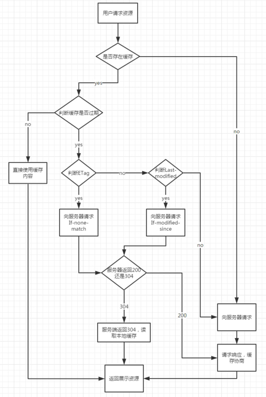

# HTTP 缓存

一个优秀的缓存策略可以缩短网页请求资源的距离，减少延迟，并且由于缓存文件可以重复利用，还可以减少带宽，降低网络负荷。

## Cache-Control
>`Cache-Control` 包括：max-age / s-maxage/public/private/no-cache/no-store/must-revalidate等

### `max-age`（单位为s）
指定设置缓存最大的有效时间，定义的是时间长短。

当浏览器向服务器发送请求后，在max-age这段时间里浏览器就不会再向服务器发送请求了。

### s-maxage（单位为s）
同max-age，只用于共享缓存（比如CDN缓存）。

比如，当s-maxage=60时，在这60秒中，即使更新了CDN的内容，浏览器也不会进行请求。也就是说max-age用于普通缓存，而s-maxage用于代理缓存。如果存在s-maxage，则会覆盖掉max-age和Expires header。

### public
指定响应会被缓存，并且在多用户间共享。如果没有指定public还是private，则默认为public。

### private
响应只作为私有的缓存（见下图），不能在用户间共享。如果要求HTTP认证，响应会自动设置为private。

### no-cache
缓存前要向服务器确认资源是否被更改

### no-store
绝对禁止缓存，每次请求资源都要从服务器重新获取。

### must-revalidate
如果资源超过过期时间，则必须去服务器获取

## Expires
指定资源到期的时间点, 与 `Last-modified` 结合使用, 优先级么有 `cache-control` 高

## Last-Modified/If-Modified-Since
当浏览器再次进行请求时，会向服务器传送 `If-Modified-Since` 报头，询问 `Last-Modified `时间点之后资源是否被修改过。如果没有修改，则返回码为304，使用缓存；如果修改过，则再次去服务器请求资源，返回码和首次请求相同为200，资源为服务器最新资源。

## Etag/If-None-Match
根据实体内容生成一段hash字符串，标识资源的状态
解决了 `last-modified` 的一些问题
- 某些服务器不能精确得到资源的最后修改时间，这样就无法通过最后修改时间判断资源是否更新 
- 如果资源修改非常频繁，在秒以下的时间内进行修改，而`Last-modified`只能精确到秒 
- 一些资源的最后修改时间改变了，但是内容没改变，使用`ETag`就认为资源还是没有修改的。

## 缓存使用流程

