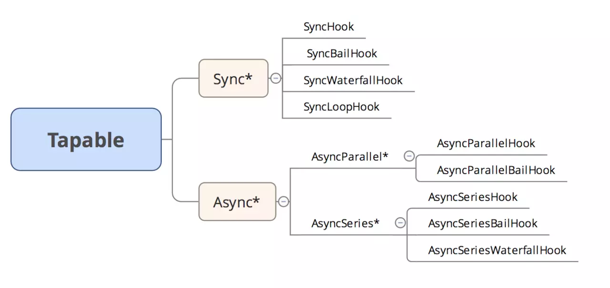

# Tapable

`Webpack` 本质上是一种事件流的机制，它的工作流程就是将各个插件串联起来，而实现这一切的核心就是 `Tapable`. 

`tapable` 拥有9中钩子，同步四种，异步五种。



```js
const {
  SyncHook,                     // 同步钩子， 不关心返回值
  SyncBailHook,                 // 同步熔断钩子， 有一个返回 null 则后续不再执行
  SyncWaterfallHook,            // 同步瀑布流钩子， 前一个钩子结果作为后一个入参
  SyncLoopHook,                 // 同步循环钩子， 返回true继续循环，返回undefine结束循环
  AsyncParallelHook,            // 异步并行
  AsyncParallelBailHook,        // 异步并行熔断
  AsyncSeriesHook,              // 异步串行
  AsyncSeriesBailHook,          // 异步串行熔断
  AsyncSeriesWaterfallHook      // 异步串行瀑布流
} = require("tapable");
```

伪代码简单模拟一下几个钩子做的事情，帮助理解

## SyncHook
```js
class SyncHook{
  constructor() {
    this.tasks=[];
  }
  tap(name,task) {
    this.tasks.push(task);
  }
  call() {
    this.tasks.forEach(task=>task(...arguments));     // 调用回调不关心返回值
  }
}
```

## SyncBailHook
```js
class SyncBailHook{
  constructor() {
    this.tasks=[];
  }
  tap(name,task) {
    this.tasks.push(task);
  }
  call() {
    let i=0, ret;
    do {
      ret=this.tasks[i++](...arguments);              // 返回不为 null 继续执行
    } while (ret !== null);
  }
}
```

## SyncWaterfallHook
```js
class SyncWaterfallHook{
  constructor() {
    this.tasks=[];
  }
  tap(name,task) {
    this.tasks.push(task);
  }
  call() {
    let [first,...tasks]=this.tasks;                  // 前一个返回值作为后一个入参
    tasks.reduce((prev, task)=> task(prev), first(...arguments));
  }
}
```

## SyncLoopHook
```js
class SyncLoopHook{
  constructor() {
    this.tasks=[];
  }
  tap(name,task) {
    this.tasks.push(task);
  }
  call(...args) {    
    this.tasks.forEach(task => {
      let ret=true;
      do {
        ret = task(...args);                          // 返回 true 继续执行
      }while(ret === true || !(ret === undefined))
    });
  }
}
```

## AsyncParallelHook
```js
class AsyncParallelHook{
  constructor() {
    this.tasks=[];
  }
  tapAsync(name,task) {
    this.tasks.push(task);
  }
  callAsync() {
    let args=Array.from(arguments);
    let callback=args.pop();
    let i=0,length = this.tasks.length;
    function done(err) {
      if (++i == length) {                      // 有点像 promise.all 的实现
        callback(err);
      }
    }
    this.tasks.forEach(task => {
      task(...args,done);
    });
  }

  tapPromise(name,task) {
    this.tasks.push(task);
  }
  promise() {
    let promises = this.tasks.map(task => task());
    return Promise.all(promises);               // tabPromise 就用 Promise.all 了
  }
}
```

后面功能就都差不多了。。