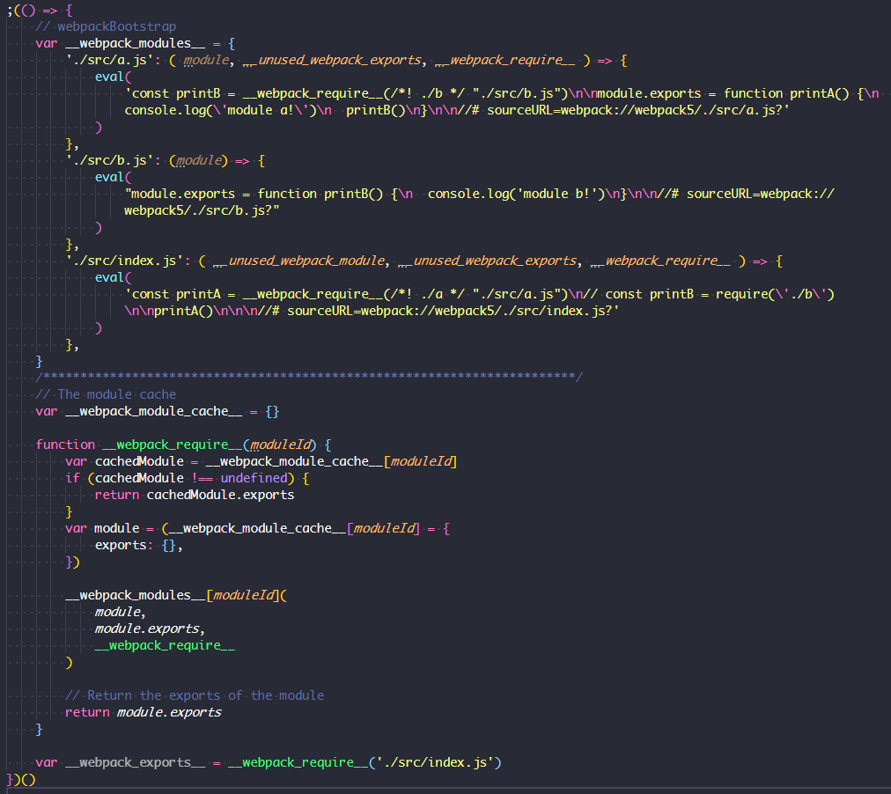

# 只需 90 行代码带你领悟 webpack

在前端社区里，webpack 可以说是一个经久不衰的话题。其强大、灵活的功能曾极大地促进了前端工程化进程的发展，伴随了无数前端项目的起与落。其纷繁复杂的配置也曾让无数前端人望而却步，笑称需要一个新工种"webpack配置工程师"。作为一个历史悠久，最常见、最经典的打包工具，webpack 极具讨论价值。理解 webpack，掌握 webpack，无论是在面试环节，还是在日常项目搭建、开发、优化环节，都能带来不少的收益。那么本文将从核心理念出发，带各位读者拨开 webpack 的外衣，看透其本质。

## 究竟是啥
其实这个问题在 webpack 官网的第一段就给出了明确的定义：

>At its core, webpack is a static module bundler for modern JavaScript applications. When webpack processes your application, it internally builds a dependency graph which maps every module your project needs and generates one or more bundles.

其意为：
>webpack的核心是用于现代 JavaScript 应用程序的**静态模块捆绑器**。 当 webpack 处理您的应用程序时，它会在内部构建一个**依赖关系图**，该图映射您项目所需的每个模块并生成一个或多个捆绑包。

要素察觉：**静态模块捆绑器**、**依赖关系图**、**生成一个或多个捆绑包**。虽然如今的前端项目中，webpack 扮演着重要的角色，囊括了诸多功能，但从其本质上来讲，其仍然是一个“前端模块打包器”，将开发者的 JavaScript 模块打包成一个或多个 JavaScript 文件。

## 要干什么
那么，为什么需要一个模块打包器呢？webpack 仓库早年的 README 也给出了答案：

>As developer you want to reuse existing code. As with node.js and web all file are already in the same language, but it is extra work to use your code with the node.js module system and the browser. The goal of `webpack` is to bundle CommonJs modules into javascript files which can be loaded by `<script>`-tags.

可以看到，`node.js` 生态中积累了大量的 `JavaScript` 写的代码，却因为 `node.js` 端遵循的 `CommonJS` 模块化规范与浏览器端格格不入，导致代码无法得到复用，这是一个巨大的损失。于是 `webpack` 要做的就是将这些模块打包成 `JavaScript` 文件以便浏览器可以使用 `<script>` 标签加载并运行这些代码。

或许这并不是唯一解释 `webpack` 存在的原因，但足以给我们很大的启发——把 `CommonJS` 规范的代码转换成可在浏览器运行的 `JavaScript` 代码

## 怎么干的
既然浏览器端没有 `CommonJS` 规范，那就实现一个好了。从 webpack 打包出的产物，我们能看出思路。



上图中，使用了 webpack 打包3个简单的 js 文件 `index.js`/`a.js`/`b.js`, 其中 `index.js` 中依赖了 `a.js`, 而 `a.js` 中又依赖了 `b.js`, 形成一个完整依赖关系。

可以看到最终输出里，三个文件被以键值对的形式保存到 `__webpack_modules__` 对象上, 对象的 `key` 为模块路径名，`value` 为一个被包装过的模块函数。函数拥有 `module`, `module.exports`, `__webpack_require__` 三个参数。这使得每个模块都拥有 `exports` 导出本模块和 `require` 引入其他模块的能力，同时保证了每个模块都处于一个隔离的函数作用域范围。

而下面的 `__webpack_require__`函数与 `__webpack_module_cache__` 对象则完成了模块加载的职责。使用 `__webpack_require__` 函数加载完成的模块被缓存到 `__webpack_module_cache__` 对象上，以便下次加载时，不需要重新运行模块的包装函数。

不能说这个由 `webpack` 实现的模块加载器与 `CommonJS` 规范一毛一样，只能说八九不离十吧。这样一来，打包后的 `JavaScript` 文件可以被 `<script>` 标签加载且运行在浏览器端了。

## 简易实现

了解了 `webpack` 处理后的 `JavaScript` 长成什么样子，我们梳理一下思路，依葫芦画瓢手动实现一个简易的打包器，帮助理解。

要做的事情有这么些：

1. 读取入口文件，并收集依赖信息
2. 递归地读取所有依赖模块，产出完整的依赖列表
3. 将各模块内容打包成一个完整产出文件

话不多说，创建一个项目，并安装所需依赖

```js
npm init -y
npm i @babel/core @babel/parser @babel/traverse webpack webpack-cli -D
```

其中：
- `@babel/parser` 用于解析源代码，产出 AST
- `@babel/traverse` 用于遍历 AST，找到 `require` 语句并修改成
- `@babel/core` 用于将修改后的 AST 转换成新的代码输出

创建一个入口文件 myPack.js 并引入依赖

```js
const fs = require("fs");
const path = require("path");
const parser = require("@babel/parser");
const traverse = require("@babel/traverse").default;
const babel = require("@babel/core"); 
```

紧接着，我们需要对某一个模块进行解析，并产出其模块信息，包括：模块路径、模块依赖、模块转换后代码

```js
// 保存根路径，所有模块根据根路径产出相对路径
let root = process.cwd()

function readModuleInfo(filePath) {
    // 准备好相对路径作为module的key
    filePath = './' + path.relative(root, path.resolve(filePath)).replace(/\\+/g, '/')
    // 读取源码
    const content = fs.readFileSync(filePath, "utf-8");
    // 转换出 AST
    const ast = parser.parse(content);
    // 遍历模块 AST，将依赖收集到 deps 数组中
    const deps = [];
    traverse(ast, {
        CallExpression: ({ node }) => {
          // 如果是 require 语句，则收集依赖
          if (node.callee.name === 'require') {
            node.callee.name = '_require_'
            let moduleName = node.arguments[0].value
            moduleName += (path.extname(moduleName) ? '' : '.js')
            moduleName = path.join(path.dirname(filePath), moduleName)
            moduleName = './' + path.relative(root, moduleName).replace(/\\+/g, '/')
            deps.push(moduleName);
            node.arguments[0].value = moduleName
          }
        }
    });
    // 编译回代码
    const { code } = babel.transformFromAstSync(ast);
    return {
        filePath,
        deps,
        code
    };
}
```

接下来，我们生成从入口出发递归的找到所有被依赖的模块，并构建成依赖树

```js
function buildDependencyGraph(entry) {
  // 获取入口模块信息
  const entryInfo = readModuleInfo(entry);
  // 项目依赖树
  const graphArr = [];
  graphArr.push(entryInfo);
  // 从入口模块触发，递归地找每个模块的依赖，并将每个模块信息保存到 graphArr
  for (const module of graphArr) {
      module.deps.forEach(depPath => {
          const moduleInfo = readModuleInfo(path.resolve(depPath));
          graphArr.push(moduleInfo);
      });
  }
  return graphArr;
}
```

经过上面一步，我们已经得到依赖树能够描述整个应用的依赖情况，最后我们只需要按照目标格式进行打包输出即可

```js
function pack(graph, entry) {
  const moduleArr = graph.map(module => {
      return `"${module.filePath}": function(module, exports, _require_) {
        eval(\`` + module.code + `\`)
      }`;
  });
  const output = `;(() => {
    var modules = {
      ${moduleArr.join(',\n')}
    }
    var modules_cache = {}
    var _require_ = function(moduleId) {
      if (modules_cache[moduleId]) return modules_cache[moduleId].exports

      var module = modules_cache[moduleId] = {
        exports: {}
      }
      modules[moduleId](module, module.exports, _require_)
      return module.exports
    }

    _require_('${entry}')
  })()`;
  return output;
}
```

直接使用字符串模板拼接成类 CommonJS 规范的模板，自动加载入口模块，并使用 IIFE 将代码包装，保证代码模块不会影响到全局作用域。

最后，编写一个入口函数 `main` 用以启动打包过程
```js
function main(entry = './src/index.js', output = './dist.js') {
  fs.writeFileSync(output, pack(buildDependencyGraph(entry), entry))
}

main()
```

执行并验证结果
```js
node myPack.js
```

至此，我们使用了总共不到 90 行代码（包含注释），完成了一个极简的模块打包工具。虽然没有涉及任何 `Webpack` 源码， 但我们从打包器的设计原理入手，走过了打包工具的核心步骤，简易却不失完整。

## 总结

本文从 `webpack` 的设计理念和最终实现出发，梳理了其作为一个打包工具的核心能力，并使用一个简易版本实现帮助更直观的理解其本质。总的来说，`webpack` 作为打包工具无非是**从应用入口出发，递归的找到所有依赖模块，并将他们解析输出成一个具备类 `CommonJS` 规范的模块加载能力的 `JavaScript` 文件**。

因其优秀的设计，在实际生产环节中，`webapck` 还能扩展出诸多强大的功能。然而其本质仍是模块打包器。不论是什么样的新特性或新能力，只要我们把握住打包工具的核心思想，任何问题终将迎刃而解。
