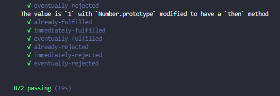

# 如何手写实现一个 promise

## promise

`promise` 维护一个状态机，只可能存在三种状态, 只允许从 `pending -> fulfilled` 或 `pending -> rejected`。

```
const PENDING = 'pending'       // 等待完成状态
const FULFILLED = 'fulfilled'   // 完成状态
const REJECTED = 'rejected'     // 失败状态
```

`promise` 构造函数接受一个函数作为 `excutor`, 会立即执行 `excutor`, 并传入 `resolve`, `reject` 两个函数作为参数。由用户选择在合适的时机调用 `resolve` 或 `reject` 完成 `promise`。

于是，在构造器中我们初始化状态 `status` 为 `pending`, 同时准备好 `value` 属性作为成功的值, `reason` 作为失败的原因, `onFulfilledCallbacks/onRejectedCallbacks` 分别作为成功/失败后的回调队列。

要点
- 维护三个状态，状态只有两种流向， `pending -> fulfilled / pending -> rejected`
- 成功/失败后调用 成功回调/失败回调 队列, 传入成功值/失败原因
- 立即执行传入的 `excutor(resolve, reject)`, 若报错 直接 `reject`
```
class Promise {
  constructor(excutor) {
    this.status = PENDING                           // Promise 维持一个状态机，只有pending, fulfilled, rejected 三个状态
    this.value = undefined                          // fulfilled 时执行的结果
    this.reason = undefined                         // rejected 时 失败的原因
    this.onFulfilledCallbacks = []                  // fulfilled 时 执行的回调列表
    this.onRejectedCallbacks = []                   // rejected 时执行的回调列表

    let resolve = value => {
      if (this.status !== PENDING) return                   // 只允许 pending --> fulfilled
      this.status = FULFILLED                               // 状态 置为 fulfilled
      this.value = value                                    // 保存 value
      this.onFulfilledCallbacks.forEach(fn => fn(value))    // 循环回调
    }
    let reject = reason => {
      if (this.status !== PENDING) return                   // 只允许 pending --> rejected
      this.status = REJECTED                                // 状态 置为 rejected
      this.reason = reason                                  // 保存 rejected 原因
      this.onRejectedCallbacks.forEach(fn => fn(reason))    // 循环失败回调
    }

    try {
      excutor(resolve, reject)                                   // 执行 执行器
    } catch(e) {
      reject(e)                                             // 执行器直接报错则 reject
    }
  }
}
```

## then
`promise` 创建后通过 `then` 方法为当前 `promise` 提供成功回调/失败函数 也就是 `onFulfilled/onRejected` 函数。同时 `.then` 方法需要返回一个 `new promise` 以便能被链式调用。

要点
- `then` 返回一个新的 `promise` 实例, 用于链式调用
- `onFulfilled/onRejected` 不一定是函数，需要处理参数将其转换为函数
- `onFulfilled/onRejected` 都需要异步执行，我们无法模拟微任务，于是使用 `setTimeout`
- `onFulfilled/onRejected` 执行也可能报错，需要将错误向后传递，也就是 `reject`
- `onFulfilled/onRejected` 处理的结果需要被 `resolvePromise` 再处理

```
then (onFulfilled, onRejected) {
    // 做一个参数处理，onFullfilled 若不是函数，则变成函数
    onFulfilled = typeof onFulfilled === 'function' ? onFulfilled : value => value
    // onRejected 若不是函数则变为一个 throw 的函数
    onRejected = typeof onRejected === 'function' ? onRejected : reason => { throw reason }

    // then 方法返回一个 new Promise 以支持链式调用
    let promise2 = new Promise((resolve, reject) => {
      if (this.status === PENDING) {                          // pending 状态则向 成功/失败回调 各推一个函数
        this.onFulfilledCallbacks.push((v) => {
          setTimeout(() => {                                  // 异步执行
            try {
              let x = onFulfilled(v)
              resolvePromise(promise2, x, resolve, reject)    // 对回调函数的值进行处理
            } catch(e) {
              reject(e)
            }
          })
        })
        this.onRejectedCallbacks.push((r) => {
          setTimeout(() => {
            try {
              let x = onRejected(r)
              resolvePromise(promise2, x, resolve, reject)
            } catch(e) {
              reject(e)
            }
          })
        })
      }

      if (this.status === FULFILLED) {
        setTimeout(() => {
          try {
            let x = onFulfilled(this.value)
            resolvePromise(promise2, x, resolve, reject)
          } catch(e) {
            reject(e)
          }
        })
      }

      if (this.status === REJECTED) {
        setTimeout(() => {
          try {
            let x = onRejected(this.reason)
            resolvePromise(promise2, x, resolve, reject)
          } catch(e) {
            reject(e)
          }
        })
      }
    })
    return promise2
  }
```

### resolvePromise

处理 `onFulfilled/onRejected` 返回值 `x`。

要点
- 处理循环引用，抛出 `TypeError`
- `thenable` 判断, `x.then` 存在且是函数则 `call`
- `then.call(x)` 的结果递归 `resolvePromise` 处理
- 防止多次 `reolve/reject`
- 普通类型直接 `resolve`

```
function resolvePromise(promise2, x, resolve, reject) {
  // 循环引用 throw new TypeError()
  if (promise2 === x) {
    throw new TypeError('循环引用了')
  }

  // 是对象或函数，则判断其有没有 then 属性
  if (x !== null && (typeof x === 'object' || typeof x === 'function')) {
    let then, called;
    try {
      then = x.then                                               // 注意：x.then 一定要放在 try 区域，防止 .then get 方法被重写，获取过程报错
      if (typeof then === 'function') {
        then.call(x, function(y) {
          if (called) return                                      // 防止 resolve 后 又被 reject
          called = true
          resolvePromise(promise2, y, resolve, reject)
        }, function(y) {
          if (called) return                                      // 防止 resolve 后 又被 reject
          called = true
          reject(y)
        })
      } else {
        resolve(x)
      }
    } catch(e) {
      if (called) return                                          // 防止 resolve 后 又被 reject
      called = true
      reject(e)
    }
  } else {
    // 普通类型直接 resolve
    resolve(x)
  }
}
```

## defer 适配
按照 `promise/A+` 规范提供 `deferred` 适配
```
Promise.deferred = Promise.defer = function() {                   // 提供适配器
  var defer = {}
  defer.promise = new Promise((resolve, reject) => {
    defer.resolve = resolve
    defer.reject = reject
  })
  return defer
}
```

此时核心功能完成，使用官方测试用例测试

```
// 安装 promises-aplus-tests 测试库
npm i -g promises-aplus-tests
// 测试
promises-aplus-tests promise.js
```



核心功能 OK, 继续实现其他 api, 也都是基于 `then` 方法实现

## catch

catch 方法能够捕获 promise 链传递过来的异常
```
catch(onRejected) {
  return this.then(null, onRejected)
}
```

## Promise.resolve

此方法能将传入参数转为 `promise`, 若是传入 `promise` 则直接返回

```
static resolve(v) {
  if(v instanceof Promise) return v
  return new Promise(resolve => resolve(v))
}
```

## Promise.reject

此方法能将传入参数转为失败的 `promise` 实例
```
static reject(r) {
  return new Promise((resolve, reject) => reject(r))
}
```

## finally

`finally` 方法不管 `promise` 失败还是成功都会执行, 且不会中断 `promise`, 将成功 `value` 或失败的 `reason` 传递下去

```
finally(fn) {
  return this.then(
    value => Promise.resolve(fn()).then(() => value),
    reason => Promise.reject(fn()).then(() => { throw reason })
  )
}
```

## all

一组 `promise` 都完成才算完成, 且将完成的值作为数组传递下去, 一个失败则 `reject`
```
static all(promises) {
  let i, len = promises.length
  let res = []
  return new Promise((resolve, reject) => {
    promises.forEach((item, index) => {
      Promise.resolve(item).then(
        v => {
          i++
          res[index] = v
          if (i === len) {
            resolve(res)
          }
        },
        r => reject(r)
      )
    })
  })
}
```

## race

一组 promise 赛跑, 有一个 resolve 则算 resolve

```
static race(promises) {
  return new Promise((resolve, reject) => {
    promises.forEach(p => {
      Promise.resolve(p).then(
        v => resolve(v),
        r => reject(r)
      )
    })
  })
}
```

## try

尝试一段代码，报错则直接 reject

```
static try(fn) {
  return new Promise(resolve => resolve(fn()))
}
```