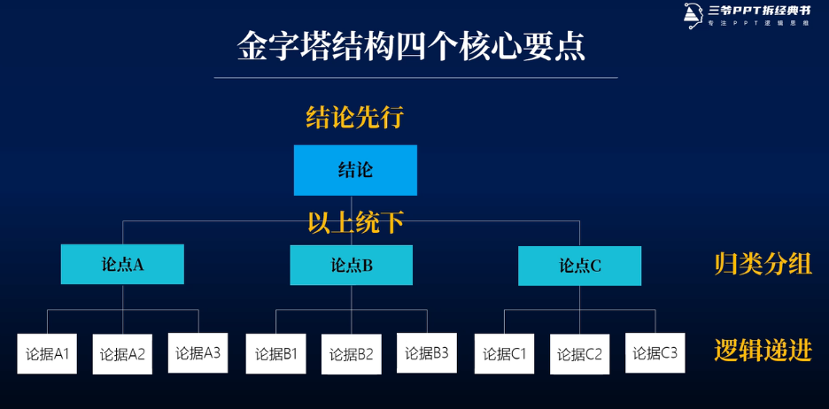
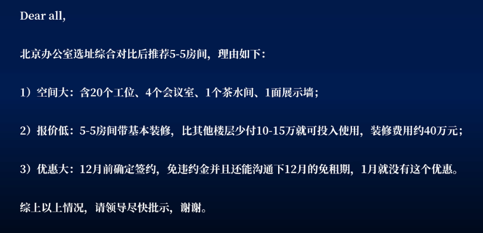
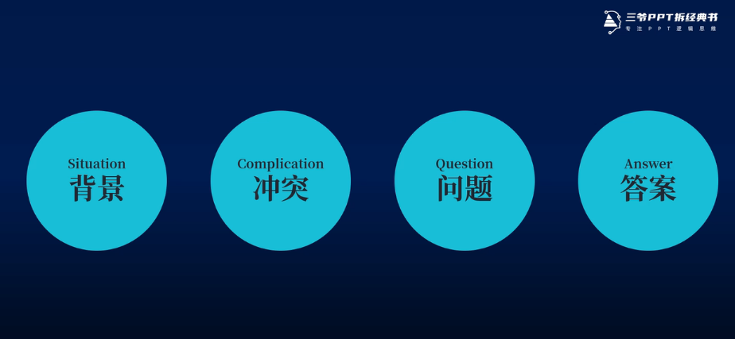
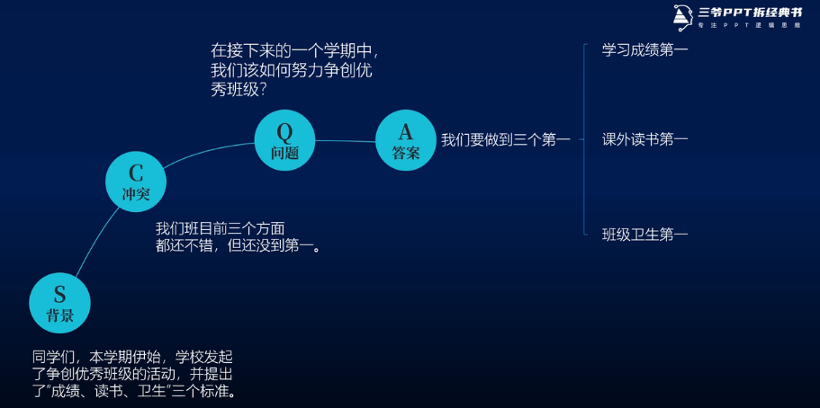
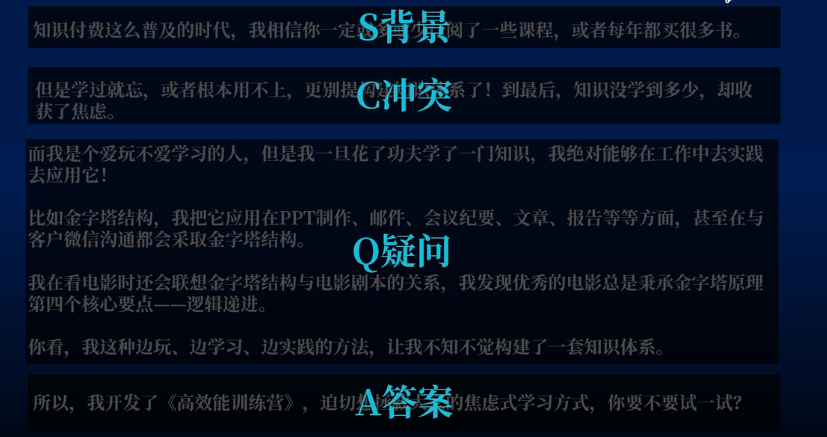
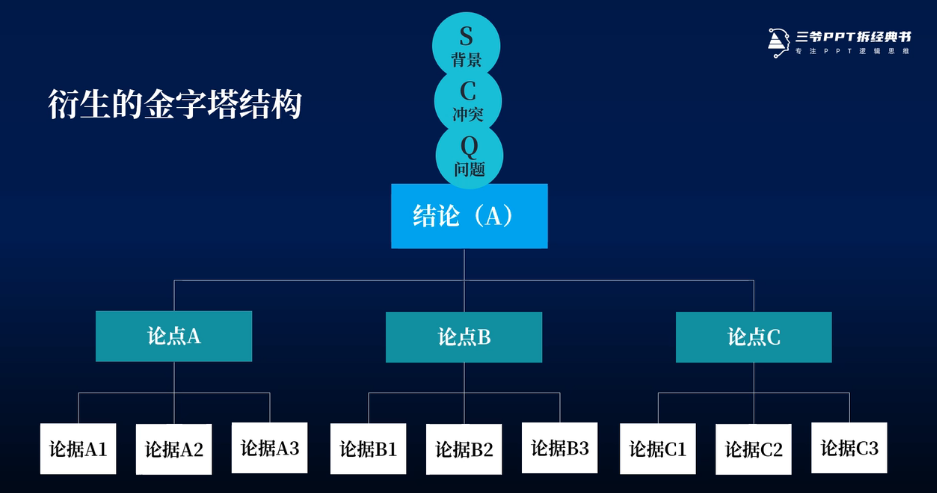
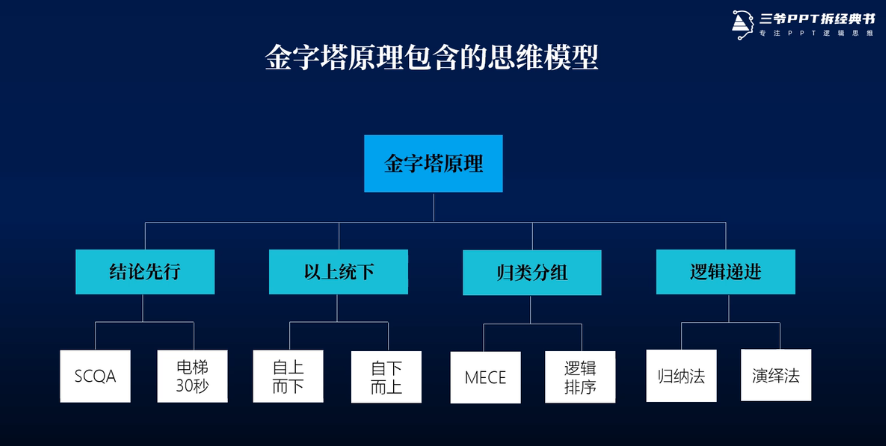
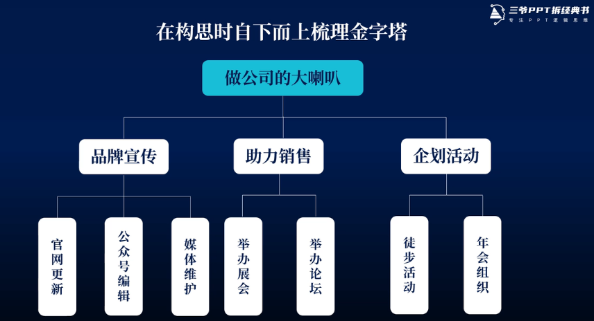
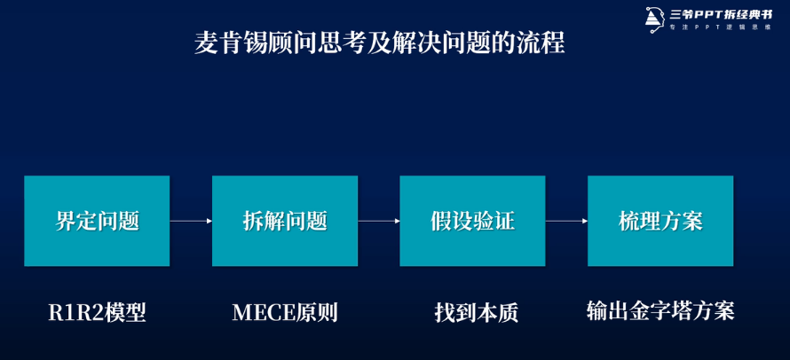
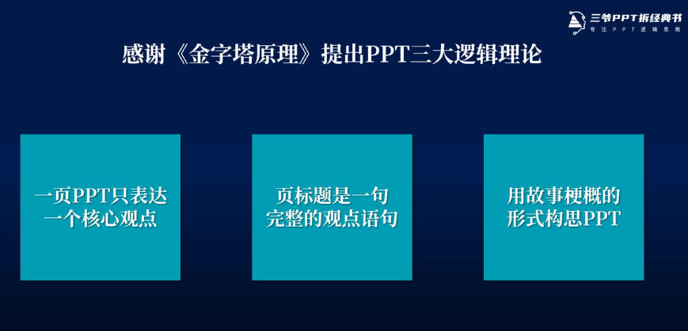

# 金字塔原理梳理

> 普通的人改变结果，优秀的人改变原因，顶级优秀的人改变思维 --查理·芒格

## 金字塔原理核心

### 表达结构：
- 结论先行
- 以上统下
- 归类分组
- 逻辑递进

举例：

### 书写结构

书写表达遵循 scqa 原则：

举例：

### 衍生金字塔结构

## 思维模型

### 电梯30秒

短时间将复杂问题总结清楚，要求语言表述一针见血，有理有据。

### 自上而下/自下而上

自上而下拆解细化，自下而上提炼总结

### 归纳法/演绎法

- 根据事物共同的特性提炼出结论

- 根据事物发展的规律推导出结论

## 洞察问题本质

## 逻辑清晰的PPT

