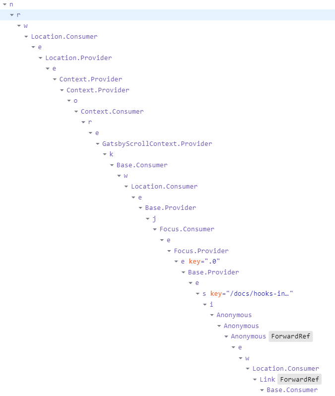

# 使用 react hooks 的几个 tips

自 2018年 React Conf 上官方宣布 React Hooks 提案后，react 社区又一次迎来一波技术更新的热潮。react hooks 技术再一次改变了已有组件的开发思维和模式，为开发效率带来提升。本文将围绕 hooks 技术总结一些实际业务中可能会用到的 tips。

<!-- ## 为什么需要 react hooks -->
<!-- 在 react hooks 面世之前，react 社区已经有了诸多处理组件逻辑的方案，比如高阶组件方案。其在 react 社区很长一段时间内，都是增强和复用组件逻辑的最流行方式。高阶组件的实现非常类似高阶函数：也就是说**高阶组件是函数，他可以接收一个普通的组件并对其增强，并返回增强后的新组件**。即

```js
const withHighOrder = Comp => EnhancedComp
```
通过高阶组件我们可以很轻易的做到逻辑复用，把公共代码逻辑抽离出来单独维护管理。然而基于类组件实现的高阶组件缺点也十分明显： -->

<!-- 在 react hooks 面世之前，react 社区已经有了诸多处理可复用组件逻辑的方案，比如高阶组件、render props等方案，但他们都有一些缺点。而 hooks 能解决高阶组件和 render props 的一些问题。 -->
<!-- 这类方案需要重新组织你的组件结构，这可能会很麻烦，使代码难以理解。如果我们打开 React DevTools 工具观察以下便会发现，由高阶组件，render props 等其他抽象层组成的组件会形成了“嵌套地狱”，干扰程序的调试。


 -->
<!-- 此前的方案: 高阶组件和 render props。这些方案都是基于组件现有机制的实现

- 高阶组件和 render props 会造成多余的组件嵌套，形成 wrapper hell
- 需要调整你的组件结构, 让代码变难以理解
- 组件各个生命周期中充斥这互不相干的逻辑代码，难以理解和拆解
- 高阶组件需要处理 ref 转发问题等

而 hooks 能让组件的内部逻辑组织成可复用的更小单元，这些单元各自维护一部分组件**状态和逻辑**。 -->


## 使用 useState 模拟 this.setState

hooks 中的 useState 与 class 组件中的 setState 方法不同，前者会直接使用传入的新值覆盖旧值。为了更方便的做旧组件代码的迁移，可以使用 useState 模拟 setState

```js
function useSetState(initalState) {
  const [_state, _setState] = useState(initalState)

  const setState = useCallback(state => {
    _setState(prevState => {
      let nextState = state
      if (typeof state === 'function') {
        nextState = state(prevState)
      }

      return { ...prevState, ...nextState }
    })
  }, [])

  return [_state, setState]
}
```

## 使用 useState/useReducer 强制刷新组件
在 class 组件中，可以通过 forceUpdate 实例方法强制刷新组件，使用 hooks 也可以做到同样效果。

```js
function useForceUpdate() {
	const [, setValue] = useState(false)
  return useCallback(() => setValue(val => !val), [])
}

function useForceUpdate() {
  const [, forceUpdate] = useReducer(x => !x)
  return forceUpdate
}
```

## 使用 useImmer 操作复杂状态
在 `react` 中，官方始终提倡使用 `immutable` 风格的数据操作，每次操作状态后始终返回一个新的状态，这样的数据操作风格很多时候能避免一些误操作改变原数据而造成的 `bug`，对数据流的可预测性有很大的提升。然而简单的数据操作我们常常能通过 `{ ...prev, ...next }` 完成浅复制，而当数据复杂起来后，操作就不那么令人如意了，比如这样的：
```js
{
	...prev,
	foo: {
		...prev.foo,
		bar: {
			...prev.foo.bar,
			baz: 'baz'
		}
	}
}
```
此时若能使用 `mutable` 的风格操作数据就好了

```js
prev.foo.bar.baz = 'baz'
```
此时，可以使用 `immer` 这个库来强化 `useState`

```js
import produce, { Draft } from "immer"

function useImmer(initialValue) {
  const [val, setValue] = useState(initialValue)
  return [
    val,
    useCallback(v => {
      setValue(produce(v));
    }, [])
  ];
}
```
使用示例：
```js
function App () {
	const [person, setPerson] = useImmer({
		name: 'BigBro',
		age: 18
	})
	const grow = () => setPerson(draft => draft.age++)
	return <div onClick={grow}>
		{ person.name } is { person.age } year old.
	</div>
}
```

有了 `immer` 保驾护航，即使使用 `mutable` 的数据操作风格，直接对原状态对象进行修改，也能保证最终操作只影响到新的一份状态数据。即能方便的对数据进行变更，又贯彻了数据操作的 `immutable` 风格。


## 使用 useRef 引用 state 最新值
虽然 react hooks 带来了非常多的好处，但也不可避免的带来了一些问题。比如令人烦躁的闭包问题。

举个例子：
```js
function Counter() {
  const [count, setCount] = useState(0)
  const inc = useCallback(() => setCount(count + 1), [])

  return <div>
		{ count }
		<ChildComp onClick={inc} />
	</div>
}
```
在这个 `Counter` 组件中，向子组件传递一个经过 `useCallback` 包装的回调函数（避免子组件由于总是接收新的 `inc` 函数而频繁重新渲染），子组件多次触发了 `onClick` 回调函数后，我们会发现，`count` 会一只显示为 `1` ！
这是因为 `useCallback` 所包装的函数是第一次 `Counter` 函数运行时生成的箭头函数，此时箭头函数中记住的 `counter` 为`0`，因此 `count + 1` 的结果始终为 `1` ！
为了让箭头函数中能拿到最新的值，可以使用 `useRef` 对函数进行改造

```js
function Counter() {
  const [count, setCount， countRef] = useRefState(0)
  const inc = useCallback(() => setCount(countRef.current + 1), [])

  return <div>
		{ count }
		<ChildComp onClick={inc} />
	</div>
}

function useRefState(initialState) {
  const ref = useRef()
  const [state, setState] = useState(initialState)
	ref.current = state
  return [state, setState, ref]
}
```
如上代码，使用自定义 hook `useRefState` 返回一个带有 `ref` 引用的数组，在 `useCallback` 所包装的箭头函数中始终使用 `ref.current` 取值，由于 `ref` 本身是不变的，而 `ref.current` 能在每一次组件状态改变后重新赋值，因此，箭头函数中也就能总是拿到最新的状态了。

## 使用 useEventCallback 包装回调函数
前文使用了 `useRef` 指向最新的 `state` 解决了回调函数中由于闭包取不到最新状态的问题，但有时候回调函数中所引用的状态并不只有一个，需要对多个状态进行改造，略显麻烦。此时我们可以换一个思路，保证回调函数是最新的，不也能保证函数执行时其中所引用的状态最新么。

```js
function useEventCallback (fn) {
  const ref = useRef();
  ref.current = fn;
  return useCallback((...args) => {
    ref.current(...args)
  }, [ref]);
}
```
如上所示，经过 `useCallback` 包装的固定函数引用传递给子组件，能做到不造成子组件因 `props` 变化而更新，同时其内部使用 `ref` 始终指向最新的 `fn`，保持了回调函数内闭包的最新。

使用示例:
```js
function Counter() {
  const [count, setCount] = useRefState(0)
  const inc = useEventCallback(() => setCount(count + 1), [])

  return <div>
		{ count }
		<ChildComp onClick={inc} />
	</div>
}
```

## 使用 useState 完成简单的跨组件状态共享
有时候我们需要多个组件之间共享一些状态，但又并不希望共享的状态被提升到 `redux` 之类的全局状态管理器中，显得有点杀鸡用牛刀，这时可以使用 `useState` 完成小型的局部状态共享工具。

```js
const queue = [];
function useSharedState(initialState) {
  const [state, setState] = useState(initialState)

  useEffect(() => {
    queue.push(setState)
    return () =>
      queue.splice(
        queue.findIndex((fn) => fn === setState),
        1
      )
  }, [])

  const flush = useCallback((v) => queue.forEach((q) => q(v)), [])
  return [state, flush]
}
```

## 总结
本文总结了一些在日常的业务中可能会遇到的一些简单场景的 hooks 解决方案。由于 `hooks` 本质就是 `JavaScript` 函数，可以非常方便的组合和复用，灵活使用好 `hooks` api 能为业务提升不少效率。